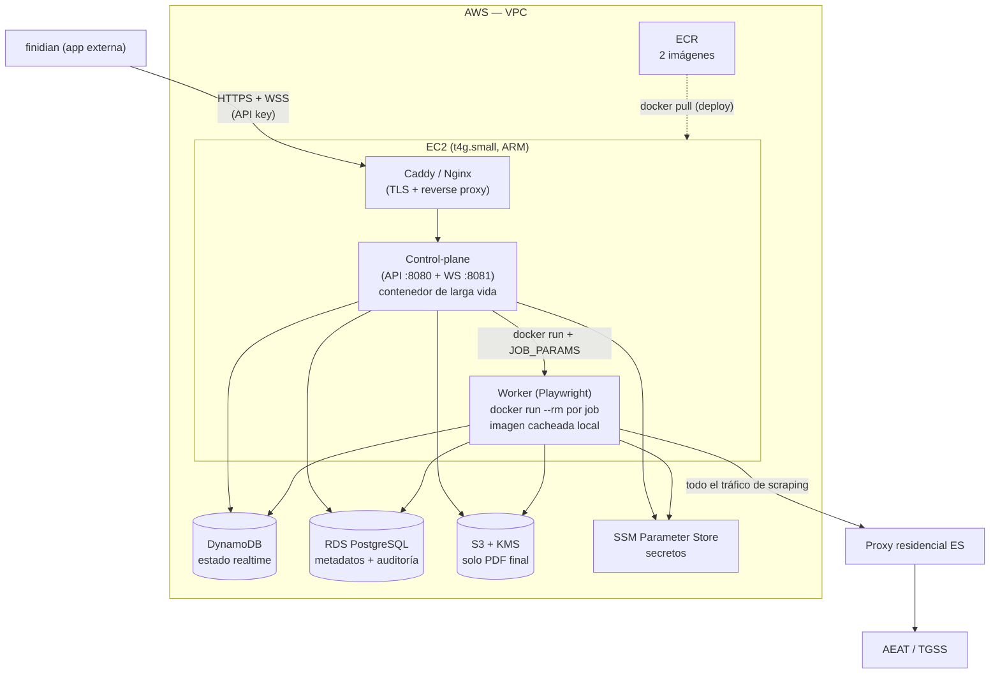

# Arquitectura de Despliegue — EC2 (optimizada por coste)

> Actualizado: 2026-06-27
> Decisión: desplegar sobre **una sola instancia EC2** por coste y baja concurrencia (pre-producción).
> Diseño funcional completo en [plan_arquitectura_rpa_espana.md](plan_arquitectura_rpa_espana.md).

## 0. Resumen ejecutivo

- **Un único EC2** ejecuta el **control-plane** (API REST + WS hub) como contenedor de larga vida.
- Cada extracción lanza un **contenedor worker efímero** (`docker run --rm`) en la **misma** caja. La imagen del worker queda **cacheada localmente** → arranque en **segundos**, sin el pull en frío de Fargate (~30–90 s).
- **Aislamiento por titular**: un contenedor nuevo por job (memoria y navegador frescos, destruidos al terminar). Preserva el principio "1 sesión Cl@ve = 1 contexto efímero" del plan original.
- **QR/código Cl@ve → inline** por WebSocket/HTTPS (nunca a S3). **PDF final → S3 SSE-KMS**.
- **Salida a las sedes (AEAT/TGSS) siempre vía proxy residencial ES** (las IP de AWS están geobloqueadas; esto no cambia por usar EC2).
- **CI/CD**: GitHub Actions (OIDC) → build de 2 imágenes → ECR → deploy vía SSM.

> Esta arquitectura es deliberadamente simple para validar producto a bajo coste. La **ruta de evolución a Fargate** (ya soportada por el código, `WORKER_LAUNCH_MODE=ecs`) está documentada en la §7.

---

## 1. Diagrama de despliegue



---

## 2. Cómputo — una instancia EC2

| Parámetro | Valor recomendado | Notas |
|---|---|---|
| Tipo | `t4g.small` (2 vCPU / 2 GB, ARM/Graviton) | Coste bajo; ARM = ~20% más barato. Subir a `t4g.medium` (4 GB) si Chromium genera OOM. |
| AMI | Amazon Linux 2023 (arm64) | Con Docker instalado vía `dnf install docker`. |
| Almacenamiento | 30 GB gp3 | Imagen Playwright (~2 GB) + buffer de descargas en `/tmp` del contenedor. |
| Arquitectura | `arm64` | Las imágenes ECR deben construirse multi-arch o arm64. |

### Procesos en la caja

- **Control-plane**: contenedor `restart=always` (docker compose o systemd). Escucha API `:8080` y WS `:8081`.
- **Worker**: **un contenedor por job**, `docker run --rm`, con `JOB_PARAMS` inyectado como variable de entorno. Se autodestruye al terminar (`--rm`) → no quedan datos fiscales en disco ni en memoria.

> **Por qué un contenedor por job y no inline**: aísla la sesión de cada titular (requisito de privacidad de datos fiscales) y acota el blast radius de un OOM de Chromium. El coste es ~0 porque la imagen ya está cacheada en la caja (arranque en segundos).

### Adaptación de código necesaria

El launcher actual ([src/control-plane/worker-launcher.ts](src/control-plane/worker-launcher.ts)) soporta `inline | local | ecs`. Para este diseño hay que añadir un modo **`docker`** que ejecute:

```bash
docker run --rm \
  -e JOB_PARAMS='{...}' \
  -e DATABASE_URL=... -e STATE_BACKEND=dynamo -e DOCS_BUCKET=... \
  --env-file /etc/rpa/worker.env \
  <ECR>/finidian-rpa-worker:<tag>
```

Es un cambio acotado (una rama más en `launchWorker`). Hasta tenerlo, `WORKER_LAUNCH_MODE=local` (proceso `tsx`) sirve para pruebas, pero no es el modo de producción.

---

## 3. Estado y datos

| Componente | Servicio | Por qué |
|---|---|---|
| **Estado realtime del job** (`PENDING → AWAITING_CLAVE → … → COMPLETED`) + señal de confirmación + `challenge` | **DynamoDB** (on-demand, con TTL) → `STATE_BACKEND=dynamo` | El control-plane y el worker son procesos distintos → necesitan store **compartido** (el modo `memory` no se comparte entre procesos). On-demand a bajo volumen cuesta céntimos. Ya implementado en [src/shared/state/dynamo-store.ts](src/shared/state/dynamo-store.ts). |
| **Metadatos + auditoría** (`ExtractionJob`, `ExtractionEvent`) | **RDS PostgreSQL** `db.t4g.micro` | Verdad histórica y trazabilidad legal del consentimiento. |
| **Documento final (PDF)** | **S3 + KMS** | `BlockPublicAccess`, versioning, lifecycle de retención, SSE-KMS. Lectura por **URL prefirmada** de corta duración. |

> **Opción aún más barata**: correr PostgreSQL como contenedor en la misma EC2 (coste extra $0, pero tú gestionas backups y durabilidad). Recomendado **RDS** incluso a este tamaño por las copias automáticas y para no perder datos de consentimiento si la caja muere.

---

## 4. Red y seguridad

### 4.1 Topología (optimizada por coste)

- EC2 en **subred pública** con **Elastic IP** y un **Security Group restrictivo**, en lugar de subred privada + NAT Gateway (ahorra ~$32/mes de NAT).
- **Security Group**:
  - **Inbound**: solo `443` desde el origen de finidian (su SG, su rango de IP, o el ALB si lo usas). Nada de `22` abierto a internet → administración por **SSM Session Manager** (sin SSH ni llaves).
  - **Outbound**: a internet (pull de ECR, APIs de AWS, y el endpoint del proxy). Idealmente acotado al proxy + endpoints AWS.
- **Egress a las sedes**: **siempre** vía proxy residencial ES. La IP pública del EC2 (rango AWS) **no** sirve para AEAT/TGSS; las bloquean por geofencing/reputación.

> Si prefieres postura de seguridad máxima sobre coste: EC2 en subred privada + NAT Gateway + VPC endpoints (S3, DynamoDB, ECR, SSM). Es lo "de libro", pero suma ~$32–48/mes.

### 4.2 Secretos

- **SSM Parameter Store** (SecureString) en lugar de Secrets Manager → prácticamente gratis para parámetros estándar.
- Guardar: `DATABASE_URL`, credenciales del proxy, `INTERNAL_API_TOKEN`, API key de finidian.
- La EC2 los lee mediante su **instance role** (IAM), nunca en `.env` planos en disco.

### 4.3 Exposición a finidian

- **Caddy o Nginx** en la caja termina TLS (Let's Encrypt, renovación automática) y hace reverse proxy hacia el API (`:8080`) y el WS (`:8081`). Coste $0.
  - Alternativa gestionada: **ALB** (~$16/mes) si quieres WAF y health checks gestionados.
- **Autenticación**: API key (o OAuth client-credentials) sobre las rutas públicas `POST /extractions`, `GET /jobs/:id`, `POST /jobs/:id/confirm`. El `INTERNAL_API_TOKEN` actual ([src/shared/config.ts](src/shared/config.ts)) es solo para el push interno worker→control-plane.
- **Importante**: configurar `PUBLIC_WS_URL` para que el `202` devuelva `wss://tu-dominio/...` y no `localhost` ([src/control-plane/index.ts](src/control-plane/index.ts) hoy lo tiene hardcodeado).

### 4.4 Roles IAM (instance role de la EC2)

Permisos mínimos para la caja:
- `s3:PutObject` / `s3:GetObject` sobre el bucket de docs + `kms:Encrypt|Decrypt|GenerateDataKey` sobre la key.
- `dynamodb:*Item` / `Query` sobre la tabla `extraction_jobs`.
- `ssm:GetParameter*` sobre los parámetros del proyecto.
- `ecr:GetAuthorizationToken` + pull (para el deploy).
- Acceso a RDS por credencial (en SSM) o IAM auth.

---

## 5. El reto Cl@ve (QR + código): inline, nunca a S3

- El worker extrae `qrDataUrl` (data-url) y `code`, los publica en el evento **`CODE_READY`** ([src/shared/types.ts](src/shared/types.ts), [src/worker/event-publisher.ts](src/worker/event-publisher.ts)).
- finidian lo recibe de dos formas, **sin tocar S3**:
  1. **WebSocket**: se suscribe con `?jobId=` y recibe `CODE_READY { challenge: { code, qrDataUrl, expiresAt } }`.
  2. **HTTPS polling**: `GET /jobs/:id` (requiere exponer `challenge` desde el state store cuando el estado sea `AWAITING_CLAVE` — pequeño añadido en [src/control-plane/index.ts](src/control-plane/index.ts)).
- Razón: el reto es una **credencial efímera (~80 s)** de unos KB. Pasa dentro de la respuesta que finidian ya consume → sin upload/download/cifrado/purga. **A S3 solo va el PDF final.**

---

## 6. CI/CD — GitHub Actions → ECR → EC2

> **El repo va en PRIVADO** (expone selectores, evasión y toca datos fiscales).

### 6.1 Build & push (OIDC, sin claves)

Dos repos ECR: `finidian-rpa-control-plane` (desde [Dockerfile.api](Dockerfile.api)) y `finidian-rpa-worker` (desde [Dockerfile.worker](Dockerfile.worker)).

`.github/workflows/build-and-push.yml` (resumen):
```yaml
name: build-and-push
on: { push: { branches: [main] } }
permissions: { id-token: write, contents: read }
env: { AWS_REGION: eu-west-1, CP_REPO: finidian-rpa-control-plane, WK_REPO: finidian-rpa-worker }
jobs:
  build:
    runs-on: ubuntu-latest
    steps:
      - uses: actions/checkout@v4
      - uses: aws-actions/configure-aws-credentials@v4
        with: { role-to-assume: arn:aws:iam::<ACCOUNT_ID>:role/github-actions-ecr, aws-region: "${{ env.AWS_REGION }}" }
      - id: ecr
        uses: aws-actions/amazon-ecr-login@v2
      - run: |
          docker build --platform linux/arm64 -f Dockerfile.api \
            -t $REGISTRY/$CP_REPO:${{ github.sha }} -t $REGISTRY/$CP_REPO:latest .
          docker push $REGISTRY/$CP_REPO:${{ github.sha }}; docker push $REGISTRY/$CP_REPO:latest
        env: { REGISTRY: "${{ steps.ecr.outputs.registry }}" }
      - run: |
          docker build --platform linux/arm64 -f Dockerfile.worker \
            -t $REGISTRY/$WK_REPO:${{ github.sha }} -t $REGISTRY/$WK_REPO:latest .
          docker push $REGISTRY/$WK_REPO:${{ github.sha }}; docker push $REGISTRY/$WK_REPO:latest
        env: { REGISTRY: "${{ steps.ecr.outputs.registry }}" }
```

> Build `--platform linux/arm64` para que coincida con la EC2 Graviton (o usar QEMU/buildx multi-arch).

### 6.2 Deploy a la EC2 (sin SSH)

Job posterior que usa **SSM Run Command** (no requiere inbound `22`):
```bash
aws ssm send-command \
  --document-name "AWS-RunShellScript" \
  --targets "Key=instanceids,Values=<INSTANCE_ID>" \
  --parameters 'commands=[
    "aws ecr get-login-password | docker login --username AWS --password-stdin <REGISTRY>",
    "docker pull <REGISTRY>/finidian-rpa-control-plane:<sha>",
    "docker pull <REGISTRY>/finidian-rpa-worker:<sha>",   # cachea la imagen del worker
    "cd /opt/rpa && IMAGE_TAG=<sha> docker compose up -d control-plane"
  ]'
```
- El control-plane se actualiza con `docker compose up -d`.
- El `docker pull` del worker deja la imagen **cacheada** para que los `docker run` por job arranquen en segundos.

---

## 7. Coste estimado (orden de magnitud, bajo volumen)

| Recurso | Coste aprox. / mes |
|---|---|
| EC2 `t4g.small` | ~$12–15 |
| RDS `db.t4g.micro` | ~$12–15 (o $0 si Postgres en la caja) |
| DynamoDB on-demand | céntimos |
| S3 + KMS | céntimos |
| SSM Parameter Store | $0 (parámetros estándar) |
| Sin NAT Gateway / sin ALB (Caddy) | ahorro ~$48 |
| **Proxy residencial ES** | **variable (por GB) — el coste recurrente real** |

> El factor de coste dominante no es AWS, es el **proxy residencial**. Dimensiónalo por GB de tráfico de las sesiones.

---

## 8. Trade-offs y ruta de evolución

### Lo que aceptas con este diseño
- **Punto único de fallo**: una sola caja. Aceptable en pre-producción; si se cae, no hay extracciones hasta reiniciar.
- **Escalado vertical**: más carga = instancia más grande, no más instancias. Suficiente para baja concurrencia.
- **Aislamiento "bueno, no perfecto"**: contenedor por job (no microVM por job como Fargate), pero adecuado para datos fiscales con `--rm` + contexto efímero.

### Cuándo migrar a Fargate (§ plan original)
Disparadores para pasar al modelo de dos planos en Fargate:
- Necesitas **alta disponibilidad** (sin single point of failure).
- La **concurrencia** sube y la caja no da abasto (OOM, contención de CPU).
- Quieres **aislamiento por microVM** por requisito de cumplimiento.

La migración es acotada: el código **ya** soporta `WORKER_LAUNCH_MODE=ecs` ([src/control-plane/worker-launcher.ts](src/control-plane/worker-launcher.ts)). Cambias el control-plane a un servicio ECS detrás de ALB y los workers a `RunTask`. El resto (S3, DynamoDB, RDS, proxy, eventos) no cambia.

---

## 9. Checklist de puesta en marcha

- [ ] Repo en **privado** en GitHub.
- [ ] 2 repos ECR creados.
- [ ] Rol OIDC `github-actions-ecr` (trust acotado al repo) + workflow `build-and-push`.
- [ ] VPC + subred pública + SG restrictivo (inbound 443 desde finidian; admin por SSM).
- [ ] EC2 `t4g.small` (AL2023 arm64) con Docker + Elastic IP + instance role IAM.
- [ ] Caddy/Nginx con TLS (dominio + Let's Encrypt) → reverse proxy a `:8080` y `:8081`.
- [ ] RDS PostgreSQL `db.t4g.micro` (privada) + migraciones Prisma aplicadas.
- [ ] Tabla DynamoDB `extraction_jobs` con TTL.
- [ ] Bucket S3 + KMS key (BlockPublicAccess, versioning, lifecycle, SSE-KMS).
- [ ] Parámetros en SSM Parameter Store (DB, proxy, tokens, API key finidian).
- [ ] Añadir modo `docker` al `worker-launcher` (o usar `local` para pruebas).
- [ ] `PUBLIC_WS_URL` configurado (no `localhost`).
- [ ] Exponer `challenge` en `GET /jobs/:id` para integración por polling.
- [ ] Autenticación (API key) sobre rutas públicas para finidian.
- [ ] Proxy residencial ES contratado y validado (geolocalización + sticky sessions).
- [ ] Deploy vía SSM Run Command (pull + `docker compose up -d` + pull del worker).
- [ ] Logs en CloudWatch + alarma básica (caja caída, error rate, OOM).
```
