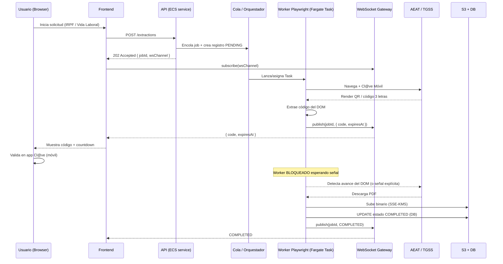

# Plan de Arquitectura — RPA de Extracción de Documentos Financieros Oficiales (España)

> Roadmap de ingeniería para una solución in-house de Robotic Process Automation (RPA) basada en Playwright (TypeScript/Node.js) desplegada en AWS ECS Fargate. Objetivo: descargar bajo consentimiento del titular la **Declaración de la Renta (IRPF)** de la AEAT y el **Informe de Vida Laboral** de la TGSS, autenticando mediante **Cl@ve Móvil** con validación humana en bucle (human-in-the-loop).

## 0. Modelo conceptual y restricciones de diseño

| Restricción | Implicación arquitectónica |
|---|---|
| Cl@ve Móvil requiere validación en el móvil del titular (`~1:20 min`) | El worker debe **bloquearse** esperando una señal externa sin morir por timeout. |
| El código de verificación (3 letras) / QR vive en el DOM | Extracción del DOM → transporte realtime → render en frontend. |
| AEAT/TGSS protegidos por WAF y fingerprinting | Tráfico saliente vía **proxy residencial rotativo ES** + stealth. |
| API Gateway corta a los 29 s (REST) | El handshake debe ser **asíncrono**; nada de HTTP síncrono de larga duración. |
| Documentos son datos personales (Cat. especial / fiscal) | Cifrado en tránsito y reposo (S3 SSE-KMS), retención mínima, trazabilidad. |

### Diagrama de flujo (alto nivel)



---

## 1. Arquitectura de Infraestructura (AWS)

### 1.1 Cómputo — ECS Fargate

**Patrón:** dos planos separados.

- **Plano de control (long-running service):** API HTTP + gestor de WebSocket + orquestador de jobs. `ECS Service` con `desiredCount >= 2` detrás de un ALB.
- **Plano de ejecución (worker efímero):** cada extracción corre en su **propia Task** (`RunTask` on-demand) para aislar la sesión de navegador, el proxy asignado y los datos personales en memoria. Una Task = una sesión Cl@ve.

#### Dimensionamiento de la Task (Chromium headless)

Chromium es intensivo en RAM y sensible a `/dev/shm`. En Fargate **no se puede** pasar `--shm-size`; el `/dev/shm` por defecto es pequeño (64 MB), por lo que es **obligatorio** lanzar Chromium con `--disable-dev-shm-usage`.

| Recurso | Valor recomendado | Justificación |
|---|---|---|
| `cpu` | `2048` (2 vCPU) | Renderizado + JS de portales pesados; evita throttling durante esperas activas. |
| `memory` | `4096` (4 GB) | 1 pestaña Chromium ronda 0.5–1.5 GB; margen para PDF en memoria. |
| `ephemeralStorage.sizeInGiB` | `21` (mín. configurable) | Buffer de descargas + perfil temporal de Chromium. |
| `platformVersion` | `1.4.0` (LATEST) | Soporte de ephemeral storage configurable. |
| `networkMode` | `awsvpc` | Requerido por Fargate; ENI dedicada por task. |
| Plataforma de CPU | `X86_64` o `ARM64` | ARM64 (Graviton) reduce coste ~20% si el build de Chromium lo soporta. |

> Combinaciones válidas Fargate: 2 vCPU admite 4–16 GB. Empezar en 2 vCPU / 4 GB; escalar a 8 GB si se observan OOM en logs (`exit code 137`).

#### Dockerfile (base)

```dockerfile
FROM mcr.microsoft.com/playwright:v1.48.0-jammy
WORKDIR /app
COPY package*.json ./
RUN npm ci --omit=dev
COPY dist ./dist
ENV NODE_OPTIONS=--max-old-space-size=3072
# Chromium no debe usar /dev/shm en Fargate
ENV PW_CHROMIUM_ARGS="--disable-dev-shm-usage --no-sandbox --disable-gpu"
ENTRYPOINT ["node", "dist/worker.js"]
```

> Usar la imagen oficial `mcr.microsoft.com/playwright` garantiza que las dependencias del SO de Chromium ya están instaladas (fuente recurrente de fallos en imágenes `node:slim`).

### 1.2 Red — Proxies Residenciales Rotativos (IP España)

Las sedes AEAT/TGSS aplican geofencing y reputación de IP. El tráfico desde rangos de **AWS (datacenter)** dispara WAF → `403 Forbidden` / retos. Mitigación obligatoria:

```
[ Fargate Task / ENI ]
        │  (todo el tráfico de Playwright)
        ▼
[ Proxy residencial ES ]  (Bright Data / Oxylabs / SOAX)
        │
        ▼
[ sede.agenciatributaria.gob.es | portal.seg-social.gob.es ]
```

- **Geo:** pool restringido a `country=es`. Validar IP de salida real al arrancar la sesión (`GET https://api.ipify.org` o equivalente vía proxy) y abortar si no es ES.
- **Sticky sessions:** la sesión Cl@ve debe completarse desde **la misma IP**. Usar `sessionId` del proveedor para fijar la IP durante toda la vida del job (no rotar a mitad de login). Rotar **entre** jobs, no **dentro** de un job.
- **Inyección en Playwright:** el proxy se pasa a nivel de contexto, no global, para permitir credenciales por sesión:

```ts
const context = await browser.newContext({
  proxy: {
    server: process.env.PROXY_SERVER,            // http://gw.provider.io:7000
    username: `${PROXY_USER}-country-es-session-${jobId}`,
    password: PROXY_PASS,
  },
});
```

- **Salida a Internet de la VPC:** la Task corre en **subred privada** con NAT Gateway hacia el proxy. No exponer la task a Internet entrante. El único ingreso es el plano de control (ALB) y el WebSocket Gateway.
- **Secrets:** credenciales de proxy en **AWS Secrets Manager**, inyectadas vía `secrets` de la task definition (no en variables de entorno planas).
- **Egress control:** Security Group de la task con egress restringido al endpoint del proxy + VPC endpoints (S3, Secrets Manager, ECR) para minimizar superficie.

### 1.3 Flujo asíncrono y manejo de estado (human-in-the-loop)

El problema central: **mantener el worker vivo y bloqueado** durante la validación móvil sin que ninguna capa lo mate por timeout.

**Principio:** nada de HTTP síncrono de larga duración. El frontend recibe `202 Accepted` inmediato y se suscribe a un canal realtime.

#### Componentes de estado

| Componente | Rol |
|---|---|
| **API Gateway WebSocket API** (o ALB+WS en el service) | Canal `backend → frontend` para el código y los cambios de estado. |
| **DynamoDB** (tabla `extraction_jobs`) | Fuente de verdad del estado del job (`PENDING → AWAITING_CLAVE → VALIDATED → DOWNLOADING → COMPLETED/FAILED`) + `connectionId` del WS + `expiresAt` (TTL). |
| **Señal de confirmación** | Canal `frontend → worker`. Dos opciones (ver abajo). |
| **Step Functions** (opcional) | Orquestación del ciclo de vida del job con `.waitForTaskToken` para el gate humano. |

#### Cómo se bloquea y reanuda el worker

El worker **no necesita** una señal explícita del usuario en muchos casos: tras validar en el móvil, **el propio DOM de la sede avanza**. Estrategia primaria:

```ts
// Tras extraer y publicar el código, esperar a que el portal redirija/avance
await page.waitForURL('**/portal/**', { timeout: 95_000 }); // > 1:20 min del timer Cl@ve
// o esperar el selector de la zona privada
await page.waitForSelector('#zona-privada', { timeout: 95_000 });
```

Señal explícita (defensa en profundidad y para UX/cancelación) — **patrón recomendado: Step Functions Task Token**:

1. El orquestador arranca con `waitForTaskToken`; el `taskToken` viaja al worker.
2. El worker publica el código al frontend y entra en `page.waitForURL(...)`.
3. Cuando el frontend recibe del usuario "ya validé" (o detecta COMPLETED), llama `POST /jobs/{id}/confirm` → Lambda → `SendTaskSuccess(taskToken)`.
4. El worker continúa. Si caduca → `SendTaskFailure` → cleanup.

Alternativa sin Step Functions: **long-poll a DynamoDB / Redis pub-sub**. El worker hace `await waitForSignal(jobId, { timeout: 95s })` consultando el flag `validated` o suscrito a un canal Redis (ElastiCache). Más simple, menos trazable.

#### Anti-timeout checklist

- **API Gateway REST:** jamás esperar el resultado en la request inicial → `202` + `jobId`. (REST corta a 29 s; el WebSocket API no tiene ese límite mientras haya tráfico.)
- **WebSocket idle:** el idle timeout de API Gateway WS es 10 min y el connection timeout 2 h → cubre de sobra el `1:20`. Enviar `ping` cada 30 s para evitar cierres de proxies intermedios.
- **ALB (si se usa para WS en el service):** subir `idle_timeout.timeout_seconds` por encima de la ventana Cl@ve (p. ej. 120 s) y mantener heartbeat.
- **Worker:** los `timeout` de Playwright para los `waitFor*` del gate humano deben ser **> 95 s** (margen sobre el `1:20`). El resto de navegación, timeouts normales (30 s).
- **Fargate:** sin límite de vida de la task; coste = tiempo vivo. Implementar **watchdog** que mate la task si el job supera un máximo absoluto (p. ej. 8 min) para evitar tasks zombi.

---

## 2. Estrategia de Evasión y Scraping (Playwright)

### 2.1 `playwright-extra` + `puppeteer-extra-plugin-stealth`

```ts
import { chromium } from 'playwright-extra';
import StealthPlugin from 'puppeteer-extra-plugin-stealth';

chromium.use(StealthPlugin());

export async function launchBrowser() {
  return chromium.launch({
    headless: true, // 'new' headless de Chromium; evitar el headless legacy detectable
    args: [
      '--disable-dev-shm-usage',
      '--no-sandbox',
      '--disable-blink-features=AutomationControlled',
      '--disable-features=IsolateOrigins,site-per-process',
      '--lang=es-ES',
    ],
  });
}
```

**Configuración de contexto coherente (fingerprint ES):**

```ts
const context = await browser.newContext({
  locale: 'es-ES',
  timezoneId: 'Europe/Madrid',
  geolocation: { latitude: 40.4168, longitude: -3.7038 }, // Madrid
  permissions: ['geolocation'],
  userAgent: REALISTIC_UA,            // UA de Chrome estable reciente, NO el de Playwright
  viewport: { width: 1366, height: 768 },
  deviceScaleFactor: 1,
  proxy: { /* sección 1.2 */ },
});
await context.addInitScript(() => {
  Object.defineProperty(navigator, 'webdriver', { get: () => undefined });
});
```

**Reglas estrictas de evasión:**

- Coherencia total: `locale`, `timezoneId`, `Accept-Language` y la IP del proxy deben ser **todos ES**. Una incoherencia (IP ES + `timezone America/...`) es señal clásica de bot.
- No usar el User-Agent que Playwright pone por defecto (contiene `HeadlessChrome`).
- Movimiento humano: `page.locator(...).hover()` antes de `click`, pausas aleatorias (`200–800 ms`), `type({ delay })` en inputs en lugar de `fill` en campos sensibles del login.
- Una IP + una sesión Cl@ve + un contexto efímero por job; destruir el `context` al terminar (no reutilizar perfiles entre titulares — además es requisito de privacidad).
- Respetar `robots`/ToS y operar **solo con consentimiento explícito del titular** de los datos (es un RPA delegado, no scraping de terceros).

### 2.2 Selectores dinámicos e iframes (AEAT y TGSS)

Las sedes usan IDs autogenerados, paneles inyectados por JS y, sobre todo, **iframes** (especialmente el widget de Cl@ve). Estrategia:

- **Selectores resilientes en cascada:** preferir roles/textos accesibles y atributos estables; nunca depender de clases ofuscadas.
  ```ts
  // Bien: ancla semántica
  page.getByRole('button', { name: /acceder|identificarse/i });
  page.getByText('Cl@ve Móvil', { exact: false });
  // Evitar: page.locator('.x-btn-3489 > span:nth-child(2)')
  ```
- **Auto-waiting:** confiar en el auto-waiting de Playwright; añadir `waitForLoadState('networkidle')` solo donde el portal carga por XHR.
- **Iframes (Cl@ve):** el flujo de identificación suele vivir en un `iframe` (frame de `clave.gob.es`). Usar `frameLocator`:
  ```ts
  const claveFrame = page.frameLocator('iframe[src*="clave"]');
  const code = await claveFrame.getByTestId('codigo-verificacion').innerText();
  ```
  Si el selector exacto no es estable, localizar el frame por URL y dentro buscar el patrón de **3 letras mayúsculas** (`/^[A-Z]{3}$/`) o el `canvas`/`img` del QR.
- **Extracción del código / QR:**
  ```ts
  // Código de 3 letras
  const code = (await claveFrame.locator('text=/^[A-Z]{3}$/').first().innerText()).trim();
  // QR como imagen (data URL) para reenviar al frontend
  const qrDataUrl = await claveFrame.locator('canvas, img[alt*="QR"]').first()
    .evaluate((el: HTMLCanvasElement | HTMLImageElement) =>
      'toDataURL' in el ? (el as HTMLCanvasElement).toDataURL() : (el as HTMLImageElement).src);
  // Tiempo de expiración (parsear countdown si está en el DOM)
  ```
- **Selector registry versionado:** centralizar todos los selectores en `selectors/aeat.ts` y `selectors/tgss.ts` con versión y fecha; cualquier cambio de la sede se parchea en un único punto. Acompañar con tests de humo diarios (sección 4) que alertan si un selector deja de resolver.
- **Defensa ante captchas/retos:** detectar pantallas de error/WAF (`403`, texto "acceso denegado", reCAPTCHA) y fallar rápido marcando el job `BLOCKED_WAF` para rotar IP en el reintento.

### 2.3 Diferencias de flujo esperadas: AEAT (Renta) vs TGSS (Vida Laboral)

| Aspecto | AEAT — Declaración Renta (IRPF) | TGSS — Informe Vida Laboral |
|---|---|---|
| Entrada | `sede.agenciatributaria.gob.es` → "Renta" → identificación | `portal.seg-social.gob.es` → "Import@ss"/Vida Laboral → identificación |
| Identificación | Cl@ve Móvil (entre varios métodos: certificado, Cl@ve PIN, Cl@ve Permanente) | Cl@ve Móvil (vía Import@ss / SEDESS) |
| Selección previa | Hay que **elegir ejercicio fiscal** (año) y a veces expediente | Suele ser informe directo; puede pedir periodo |
| Generación PDF | Botón "Descargar"/"Obtener PDF" del borrador/declaración → descarga directa | "Descargar informe" / "Solicitar informe" → PDF (a veces se genera y aparece en zona de descargas) |
| Pasos intermedios | Más navegación (apartados de la declaración) antes del PDF | Flujo más corto, 2–3 clics tras login |
| Riesgo de cambio de UI | Alto (Renta cambia cada campaña anual) | Medio |
| Sesión | Puede requerir aceptar avisos/condiciones | Puede requerir seleccionar "para mí" vs representante |

**Implicación de diseño:** dos **scrapers especializados** que comparten un **core común** (`BaseScraper`: browser, proxy, login Cl@ve, gate humano, intercept de descarga, subida S3) y dos implementaciones (`RentaScraper`, `VidaLaboralScraper`) que sobreescriben `navigateToDocument()` y `selectParameters()`.

```ts
abstract class BaseScraper {
  abstract navigateToDocument(page: Page, params: JobParams): Promise<void>;
  abstract triggerDownload(page: Page): Promise<Download>;
  // login Cl@ve, gate humano, intercept, upload S3 → compartidos
}
```

---

## 3. Pipeline de Extracción y Persistencia

### 3.1 Interceptación de la descarga del PDF (headless)

En headless no hay diálogo de "Guardar como". Capturar el evento `download` de Playwright:

```ts
// Habilitar descargas en el contexto
const context = await browser.newContext({ acceptDownloads: true, /* ... */ });

// Disparar y capturar
const [ download ] = await Promise.all([
  page.waitForEvent('download', { timeout: 60_000 }),
  page.getByRole('button', { name: /descargar|obtener pdf/i }).click(),
]);

// Persistir a ruta temporal en el ephemeral storage
const tmpPath = path.join('/tmp', `${jobId}.pdf`);
await download.saveAs(tmpPath);
const suggested = download.suggestedFilename();
```

**Casos especiales:**
- **PDF que se abre en pestaña/visor en vez de descargar:** interceptar la respuesta de red por `Content-Type: application/pdf` y leer el buffer:
  ```ts
  page.on('response', async (res) => {
    if (res.headers()['content-type']?.includes('application/pdf')) {
      pdfBuffer = await res.body();
    }
  });
  ```
- **Generación asíncrona (TGSS):** algunos informes se "solicitan" y aparecen segundos después → `waitFor` del enlace de descarga con polling.
- **Validación del binario:** comprobar `magic bytes` (`%PDF-`) y tamaño mínimo antes de aceptar; si no, marcar `FAILED` (probable página de error servida como PDF).

### 3.2 Subida inmediata a Amazon S3

Subir en cuanto el binario está validado; **no** dejar PDFs en disco más de lo necesario (privacidad). Preferir stream sobre cargar todo en memoria para PDFs grandes.

```ts
import { S3Client } from '@aws-sdk/client-s3';
import { Upload } from '@aws-sdk/lib-storage';

const key = `extractions/${userId}/${jobId}/${docType}.pdf`;
await new Upload({
  client: s3,
  params: {
    Bucket: process.env.DOCS_BUCKET,
    Key: key,
    Body: fs.createReadStream(tmpPath),
    ContentType: 'application/pdf',
    ServerSideEncryption: 'aws:kms',         // SSE-KMS obligatorio (dato fiscal/personal)
    SSEKMSKeyId: process.env.DOCS_KMS_KEY_ID,
    Metadata: { jobId, userId, docType, source: 'AEAT|TGSS' },
  },
}).done();

// Borrar la copia local inmediatamente
await fs.promises.unlink(tmpPath);
```

**Hardening del bucket:** `BlockPublicAccess` total, versioning, política TLS-only, lifecycle para expiración/retención según política de datos, y acceso de lectura solo vía **URLs prefirmadas** de corta duración generadas por el plano de control.

### 3.3 Actualización asíncrona de metadatos en PostgreSQL (Prisma)

Estado del documento como máquina de estados, persistido en Postgres (RDS). El worker actualiza vía Prisma al finalizar cada fase.

```prisma
// schema.prisma
enum ExtractionStatus {
  PENDING
  AWAITING_CLAVE
  VALIDATED
  DOWNLOADING
  COMPLETED
  FAILED
  BLOCKED_WAF
  EXPIRED
}

enum DocType {
  IRPF_RENTA
  VIDA_LABORAL
}

model ExtractionJob {
  id            String           @id @default(cuid())
  userId        String
  docType       DocType
  status        ExtractionStatus @default(PENDING)
  source        String                      // "AEAT" | "TGSS"
  fiscalYear    Int?                         // ejercicio (solo IRPF)
  s3Bucket      String?
  s3Key         String?
  fileSizeBytes Int?
  checksumSha256 String?
  proxySession  String?
  errorCode     String?
  errorMessage  String?
  startedAt     DateTime?
  completedAt   DateTime?
  createdAt     DateTime         @default(now())
  updatedAt     DateTime         @updatedAt

  @@index([userId, docType])
  @@index([status])
}
```

```ts
// Transiciones desde el worker
await prisma.extractionJob.update({
  where: { id: jobId },
  data: {
    status: 'COMPLETED',
    s3Bucket: process.env.DOCS_BUCKET,
    s3Key: key,
    fileSizeBytes: size,
    checksumSha256: sha256,
    completedAt: new Date(),
  },
});
```

**Reglas de persistencia:**
- Cada cambio de estado se persiste **y** se publica al frontend vía WebSocket (DB = verdad histórica; WS = realtime).
- Idempotencia: usar `jobId` (cuid) como clave; reintentos no deben duplicar filas ni resubir si ya está `COMPLETED`.
- Nunca guardar el PDF ni el código Cl@ve en la base de datos; solo metadatos y puntero a S3.
- Pool de conexiones: usar el `connection_limit` de Prisma acotado (workers efímeros + RDS → riesgo de agotar conexiones); considerar **RDS Proxy** si el número de tasks concurrentes es alto.
- Auditoría: tabla `ExtractionEvent` append-only (jobId, fromStatus, toStatus, ts, meta) para trazabilidad legal del consentimiento y del flujo.

---

## 4. Roadmap de Desarrollo (Checklist)

### 4.1 Setup de Infraestructura

- [ ] Crear repos/monorepo: `control-plane` (API + WS), `worker` (Playwright), `infra` (IaC).
- [ ] Definir IaC (CDK o Terraform) para VPC con subredes privadas + NAT Gateway.
- [ ] Crear ECR y pipeline de build de la imagen del worker (base `mcr.microsoft.com/playwright`).
- [ ] Definir Task Definition Fargate (2 vCPU / 4 GB, ephemeral 21 GB, `--disable-dev-shm-usage`).
- [ ] Configurar ECS Service del plano de control (>=2 tareas, ALB, health checks).
- [ ] Provisionar API Gateway WebSocket API (`$connect`, `$disconnect`, rutas custom).
- [ ] Provisionar DynamoDB `extraction_jobs` (con TTL en `expiresAt`) o ElastiCache Redis para señal/estado realtime.
- [ ] Provisionar RDS PostgreSQL + (opcional) RDS Proxy.
- [ ] Crear bucket S3 de documentos con SSE-KMS, BlockPublicAccess, versioning, lifecycle.
- [ ] Configurar KMS key + políticas de acceso (worker write, control-plane read presigned).
- [ ] Cargar credenciales de proxy y secretos en Secrets Manager; cablear `secrets` en task def.
- [ ] Configurar Security Groups (egress task → proxy + VPC endpoints S3/Secrets/ECR).
- [ ] Configurar VPC endpoints (S3 gateway, Secrets Manager, ECR, CloudWatch Logs).
- [ ] Centralizar logs en CloudWatch + alarmas (OOM `exit 137`, tasks zombi, error rate).
- [ ] Contratar/validar proxy residencial ES con sticky sessions y verificar geolocalización.

### 4.2 Scraper AEAT (Declaración de la Renta — IRPF)

- [ ] Implementar `BaseScraper` (browser, proxy por contexto, stealth, gate humano, intercept, upload).
- [ ] Configurar `playwright-extra` + stealth + fingerprint ES coherente (locale/tz/UA/geo).
- [ ] Mapear navegación: home → sección Renta → selección de ejercicio fiscal.
- [ ] Implementar selección de método Cl@ve Móvil en el widget de identificación.
- [ ] Localizar el iframe de Cl@ve y extraer código de 3 letras / QR (`frameLocator`).
- [ ] Implementar publicación del código al WS + `expiresAt` (countdown).
- [ ] Implementar gate humano (`waitForURL`/`waitForSelector` > 95 s) + señal explícita.
- [ ] Navegar hasta el borrador/declaración y disparar la descarga del PDF.
- [ ] Crear `selectors/aeat.ts` versionado + test de humo diario.
- [ ] Manejar errores AEAT: aviso legal, sin declaración para el ejercicio, WAF/403.

### 4.3 Scraper TGSS (Informe de Vida Laboral)

- [ ] Implementar `VidaLaboralScraper` extendiendo `BaseScraper`.
- [ ] Mapear navegación: portal Seguridad Social → Import@ss → Informe de Vida Laboral.
- [ ] Implementar identificación Cl@ve Móvil (flujo SEDESS/Import@ss) y extracción de código/QR.
- [ ] Manejar selección "para mí" vs representante y periodo si aplica.
- [ ] Manejar **generación asíncrona** del informe (polling del enlace de descarga).
- [ ] Implementar intercept de PDF (download event o respuesta `application/pdf`).
- [ ] Crear `selectors/tgss.ts` versionado + test de humo diario.
- [ ] Manejar errores TGSS: informe no disponible, sesión caducada, WAF/403.

### 4.4 Integración Frontend / Backend (WebSockets)

- [ ] Endpoint `POST /extractions` → crea job `PENDING`, encola y responde `202 { jobId, wsChannel }`.
- [ ] Handler `$connect`/`$disconnect` del WebSocket API + registro de `connectionId` por job.
- [ ] Publicador `backend → frontend`: eventos `CODE_READY {code|qr, expiresAt}`, `STATUS_CHANGED`, `COMPLETED`, `FAILED`.
- [ ] Endpoint `POST /jobs/{id}/confirm` (señal `frontend → worker`): `SendTaskSuccess` / set flag.
- [ ] Heartbeat/ping cada 30 s en el WS para evitar cierres intermedios.
- [ ] Orquestación con Step Functions (`waitForTaskToken`) **o** loop de señal en Redis/DynamoDB.
- [ ] Componente frontend: render de QR/código + countdown sincronizado con `expiresAt`.
- [ ] Manejo de expiración en frontend (timer agotado → estado `EXPIRED` + opción reintentar).
- [ ] Watchdog que mata tasks que superan el máximo absoluto de vida (anti-zombi).
- [ ] Pruebas de timeout: validar que API Gateway/ALB no cortan durante el `1:20`.

### 4.5 Pipeline de Datos (Extracción y Persistencia)

- [ ] Definir `schema.prisma` (`ExtractionJob`, `ExtractionEvent`, enums) + migraciones.
- [ ] Implementar intercept de descarga + validación de magic bytes `%PDF-` y tamaño mínimo.
- [ ] Implementar subida a S3 con `@aws-sdk/lib-storage` (stream) + SSE-KMS + metadata.
- [ ] Calcular checksum SHA-256 del binario y persistirlo.
- [ ] Borrar copia local (`/tmp`) inmediatamente tras subir.
- [ ] Implementar transiciones de estado idempotentes vía Prisma + tabla de auditoría.
- [ ] Generar URLs prefirmadas de corta duración en el plano de control para descarga del cliente.
- [ ] Configurar `connection_limit` de Prisma / RDS Proxy para concurrencia de workers.
- [ ] Definir política de retención/expiración del documento (lifecycle S3 + purga en DB).
- [ ] Implementar reintentos con rotación de IP ante `BLOCKED_WAF` y backoff.

### 4.6 Transversal (Seguridad, Observabilidad, Cumplimiento)

- [ ] Registro de consentimiento explícito del titular antes de iniciar cualquier extracción.
- [ ] Cifrado en tránsito (TLS) y reposo (KMS) verificado extremo a extremo.
- [ ] Redacción de logs: nunca loguear código Cl@ve, cookies de sesión ni contenido del PDF.
- [ ] Métricas: tasa de éxito por sede, tiempo medio de validación, ratio de `403`/WAF.
- [ ] Tests de humo programados (diarios) que alertan ante cambios de selectores AEAT/TGSS.
- [ ] Runbook de incidencias: rotación de proxy, rollback de selectores, kill-switch de jobs.
- [ ] Revisión legal/DPO del tratamiento de datos fiscales y de la base jurídica del RPA delegado.
